 

### SOFTWARE ENGINEER · WEB DEVELOPER · LIFELONG BUILDER

**I turn curious ideas into useful things on the web.**

 

## A little about me

I’m **NDAYISHIMIYE Eugene**, a software engineer who enjoys shaping an idea into a thoughtful, working product. I work across the web stack, keep exploring new tools, and like projects that solve everyday problems with clear, practical design.

<table>
<tr>
<td width="50%" valign="top">

### At the workbench

- Building web apps with **JavaScript, Node.js, and Express**
- Exploring backend development, APIs, and better problem solving
- Making room for personal and academic projects

</td>
<td width="50%" valign="top">

### On the learning queue

- **Python** and more confident programming fundamentals
- Modern **JavaScript (ES6+)**
- Backend patterns and API design

</td>
</tr>
</table>

## The toolkit

## A signal from the night shift

<table>
<tr>
<td width="58%" valign="middle">

Ideas are worth protecting while they’re still taking shape. This little guardian keeps watch over the workshop and has one short reminder for every curious builder:

> **Be careful.**

Stay curious, check your work, and keep your systems secure.

</td>
<td width="42%" align="center" valign="middle">

</td>
</tr>
</table>

## The build mindset

`IDEA` &nbsp; ✳ &nbsp; `DESIGN` &nbsp; ✳ &nbsp; `BUILD` &nbsp; ✳ &nbsp; `LEARN` &nbsp; ✳ &nbsp; `REPEAT`

*I’m happiest when I’m learning something new and building something that can help someone.*

**Thanks for stopping by.** &nbsp; [Explore my projects →](https://github.com/Neugene117?tab=repositories)

 

Designed with curiosity and a few late-night pixels · NDAYISHIMIYE Eugene

